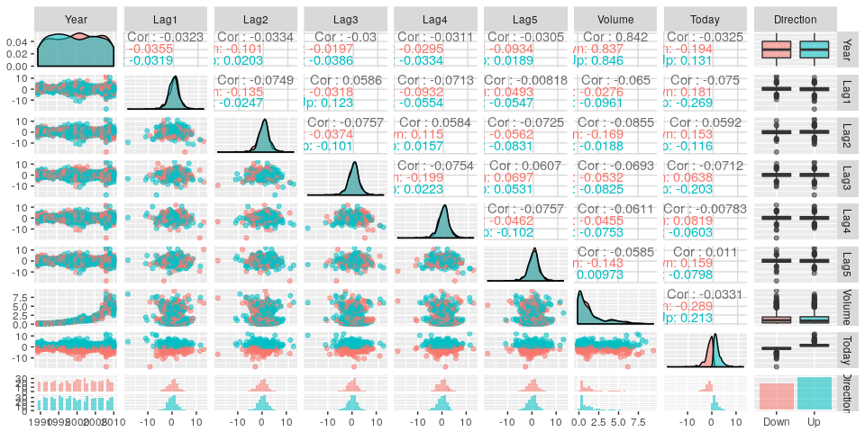
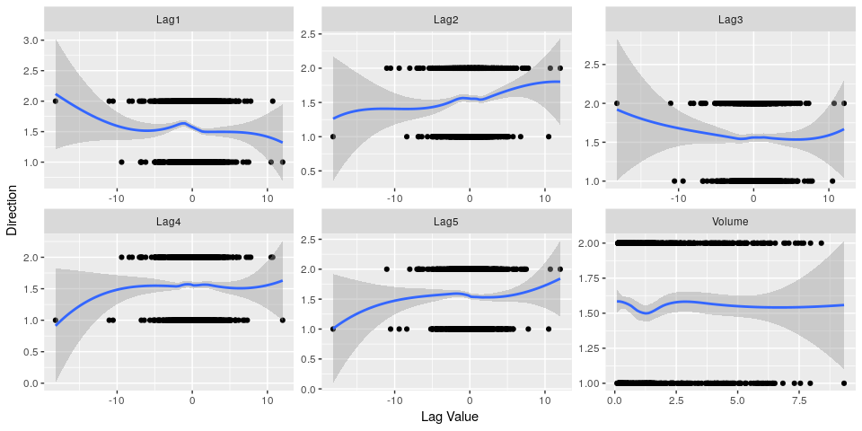
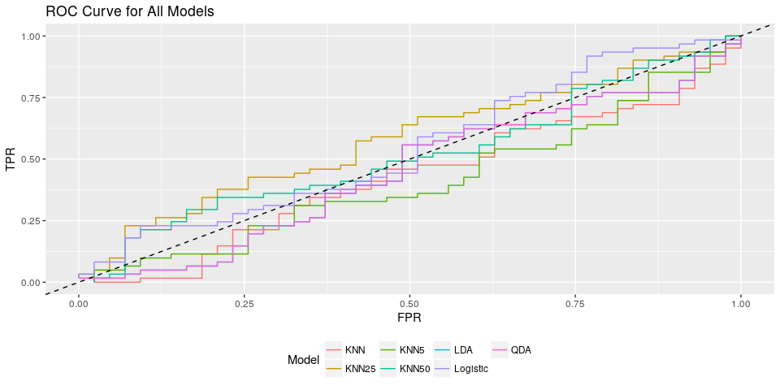
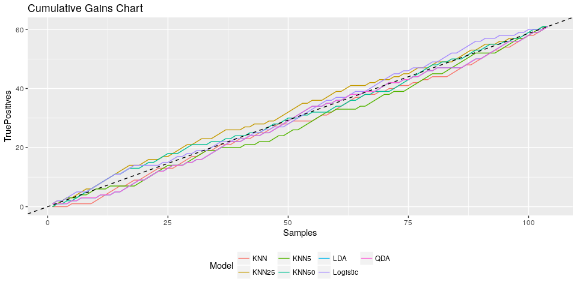
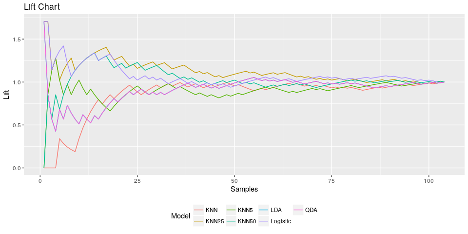

Classifying Stock Market Swings
================
Chase Baggett

Introduction
============

I am going to use Logistic Regression, Linear Discriminate Analysis, Quadratic Discriminate Analysis, and KNN to attempt to predict up and down swings in the stock market by week. I am going to use alot visualizations and charts to do model comparison as I believe them to be more effective than using traditional model diagnostics the majority of the time.

Data
====

I am using the Weekly dataset provides by the ISLR package, which were originally extracted from Yahoo Finance based on the S&P 500.

Analysis
========

Exploratory
-----------

The below plot shows how our 2 variable combinations might provide class separation, and the box plots alsohelp us see one variable relationships with the Direciton class. We have more ups than downs.

We can see the up/down variable is calculated from the Today variable, which is confusingly named as it is a measure of the Week, not the day. Most of the lags look bivariate normal without alot of separation that's apparent to the naked eye. 

In addition, fitting a smooth of direction on each of the lags and volume doesn't present any obvious break points along the lag values in which you would see a class balance change, though Lag2 looks like there might be some separation, as does Lag5, but it looks to be created a small number of points.

Fitting the Models
------------------

I am going to fit and display confusion Matrices for each of the different models, and will comment on them at the end.

### Logistic Regression

We see significance on a logistic regression from Lag2.

    ## 
    ## Call:
    ## glm(formula = Direction ~ Lag1 + Lag2 + Lag3 + Lag4 + Lag5 + 
    ##     Volume, family = binomial, data = Weekly)
    ## 
    ## Deviance Residuals: 
    ##     Min       1Q   Median       3Q      Max  
    ## -1.6949  -1.2565   0.9913   1.0849   1.4579  
    ## 
    ## Coefficients:
    ##             Estimate Std. Error z value Pr(>|z|)   
    ## (Intercept)  0.26686    0.08593   3.106   0.0019 **
    ## Lag1        -0.04127    0.02641  -1.563   0.1181   
    ## Lag2         0.05844    0.02686   2.175   0.0296 * 
    ## Lag3        -0.01606    0.02666  -0.602   0.5469   
    ## Lag4        -0.02779    0.02646  -1.050   0.2937   
    ## Lag5        -0.01447    0.02638  -0.549   0.5833   
    ## Volume      -0.02274    0.03690  -0.616   0.5377   
    ## ---
    ## Signif. codes:  0 '***' 0.001 '**' 0.01 '*' 0.05 '.' 0.1 ' ' 1
    ## 
    ## (Dispersion parameter for binomial family taken to be 1)
    ## 
    ##     Null deviance: 1496.2  on 1088  degrees of freedom
    ## Residual deviance: 1486.4  on 1082  degrees of freedom
    ## AIC: 1500.4
    ## 
    ## Number of Fisher Scoring iterations: 4

    ## Confusion Matrix and Statistics
    ## 
    ##           Reference
    ## Prediction Down Up
    ##       Down   41 56
    ##       Up      2  5
    ##                                         
    ##                Accuracy : 0.4423        
    ##                  95% CI : (0.345, 0.543)
    ##     No Information Rate : 0.5865        
    ##     P-Value [Acc > NIR] : 0.9989        
    ##                                         
    ##                   Kappa : 0.0299        
    ##  Mcnemar's Test P-Value : 3.421e-12     
    ##                                         
    ##             Sensitivity : 0.95349       
    ##             Specificity : 0.08197       
    ##          Pos Pred Value : 0.42268       
    ##          Neg Pred Value : 0.71429       
    ##              Prevalence : 0.41346       
    ##          Detection Rate : 0.39423       
    ##    Detection Prevalence : 0.93269       
    ##       Balanced Accuracy : 0.51773       
    ##                                         
    ##        'Positive' Class : Down          
    ## 

### Linear Discriminate Analysis

    ## Confusion Matrix and Statistics
    ## 
    ##           Reference
    ## Prediction Down Up
    ##       Down    9  5
    ##       Up     34 56
    ##                                          
    ##                Accuracy : 0.625          
    ##                  95% CI : (0.5247, 0.718)
    ##     No Information Rate : 0.5865         
    ##     P-Value [Acc > NIR] : 0.2439         
    ##                                          
    ##                   Kappa : 0.1414         
    ##  Mcnemar's Test P-Value : 7.34e-06       
    ##                                          
    ##             Sensitivity : 0.20930        
    ##             Specificity : 0.91803        
    ##          Pos Pred Value : 0.64286        
    ##          Neg Pred Value : 0.62222        
    ##              Prevalence : 0.41346        
    ##          Detection Rate : 0.08654        
    ##    Detection Prevalence : 0.13462        
    ##       Balanced Accuracy : 0.56367        
    ##                                          
    ##        'Positive' Class : Down           
    ## 

### Quadratic Discriminate Analysis

    ## Confusion Matrix and Statistics
    ## 
    ##           Reference
    ## Prediction Down Up
    ##       Down    0  0
    ##       Up     43 61
    ##                                           
    ##                Accuracy : 0.5865          
    ##                  95% CI : (0.4858, 0.6823)
    ##     No Information Rate : 0.5865          
    ##     P-Value [Acc > NIR] : 0.5419          
    ##                                           
    ##                   Kappa : 0               
    ##  Mcnemar's Test P-Value : 1.504e-10       
    ##                                           
    ##             Sensitivity : 0.0000          
    ##             Specificity : 1.0000          
    ##          Pos Pred Value :    NaN          
    ##          Neg Pred Value : 0.5865          
    ##              Prevalence : 0.4135          
    ##          Detection Rate : 0.0000          
    ##    Detection Prevalence : 0.0000          
    ##       Balanced Accuracy : 0.5000          
    ##                                           
    ##        'Positive' Class : Down            
    ## 

### K-Nearest Neighbors

    ## Confusion Matrix and Statistics
    ## 
    ##           Reference
    ## Prediction Down Up
    ##       Down   21 29
    ##       Up     22 32
    ##                                          
    ##                Accuracy : 0.5096         
    ##                  95% CI : (0.4097, 0.609)
    ##     No Information Rate : 0.5865         
    ##     P-Value [Acc > NIR] : 0.9540         
    ##                                          
    ##                   Kappa : 0.0127         
    ##  Mcnemar's Test P-Value : 0.4008         
    ##                                          
    ##             Sensitivity : 0.4884         
    ##             Specificity : 0.5246         
    ##          Pos Pred Value : 0.4200         
    ##          Neg Pred Value : 0.5926         
    ##              Prevalence : 0.4135         
    ##          Detection Rate : 0.2019         
    ##    Detection Prevalence : 0.4808         
    ##       Balanced Accuracy : 0.5065         
    ##                                          
    ##        'Positive' Class : Down           
    ## 

Comparing the Models
--------------------

Confusion Matrices are a very one dimensional way of looking at classifiers that ignores the tunability of some of these models. The premise behind each of the charts I am going to use is roughly the same. What we do is we work our way through the dataset from the most confident prediction (highest probability) to the lowest confidence (lowest probability), and we see how our measures of various metrics change.

The general premise here is that we should be more accurate on our higher confidence predictions, and therefore might get different types of value stopping at different points. I will go over the specific metrics used in each chart.

### ROC Plot

The ROC plot shows the trade off between True Positives and False Positives. The dashed line represents a random sort order through the data, wherein you search through 50% of the points and find 50% of the True Positives and 50% of the False Positives.

The general idea is that your model should have area under the curve to beat pure randomness. In this specific example, Logistic Regression and KNN with k=25 start off strong, but with logistic regression we lose any marginal area under the curve very early on in our model, which means that we can only effectively grab the high confidence records. However, with KNN we can continue investing much longer.

$$True Positive Rate = \\frac{True Positives}{True Positives + False Negatives}$$
*F**a**l**s**e**P**o**s**i**t**i**v**e**R**a**t**e* = /*f**r**a**c**F**a**l**s**e**P**o**s**i**t**i**v**e**s**F**a**l**s**e**P**o**s**i**t**i**v**e**s* + *T**r**u**e**N**e**g**a**t**v**i**e**s*

### Cumulative Gains Chart

The cumulative gains chart is similar to the ROC chart but very helpful when you have a class imbalance, which we do happen to have slightly in this dataset. This is very useful when you think of positive events like treasure and you cumulatively "dig" for them. Once again, the dashed line represents randomness.

We're effectively beating randomness until about the 20 most confident week with logistic regression. After which, our slope is lower than that of randomness, so our search pattern through the data using a classifier is inefficient.

However, with KNN with k=25, we beat randomness through the majority of the data.

### Lift

Traditionally, when you think of this idea of skimming the best guesses off the top, it makes sense to think of it in terms of lift. In a betting market lift can be very valuable because it helps to understand the relationship your model has to the underlying probability.

We can see that logistic regression provides us with 1.5x the probability of randomness at the beginning of the model, but declines througout. A gambler with no trading fees in a fair and unbiased market with no house edge and no aversion to risk would continue buying until his Lift was below 1, at which point the fair odds return would be negative. This assumes the house (having no edge) would pay him based on the expectation of a win, and that by having lift, he beating that expectation.

Lift can be thought of as
$$Lift = \\frac{Confidence}{E(Confidence)}$$
.

Which in this scenario, the expectation of confidence is the observed mean of the market, or the natural class balance. 

Conclusion
==========

If I were using this dataset to trade on the market, I would use KNN with k=25, as it provides the strongest results. All other models provide classification very hard to take advantage of.
